# AUVNET Internship Assessment

It's a simple e-commerce application all implemented in clean architecture and applying SOLID princples

## ➕ Features

- User authentication/registeration
- Product Browsing
- Local Shopping Cart
- Checkout
- User Profile Managment
- Order History
- Responsive Design for mobile and desktop devices
- Error Handling and Logging
- Performance Optimization

## ⏬ Installation

```bash
git clone https://github.com/AhmedSamy02/AUVNET-Internship-Assessment
flutter pub get
```

Don't forget to import the mock server from the [mock](./mock) folder.

## 📷 Screenshots

| Splash Screen | Landing Screen | Login Screen |
|:-------------:|:--------------:|:------------:|
|  | 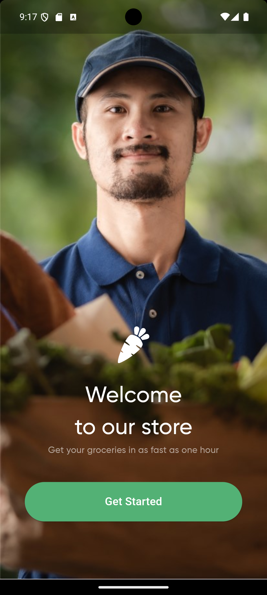 |  |

| Register Screen | Shop Screen | Product Details Screen |
|:---------------:|:-----------:|:----------------------:|
| 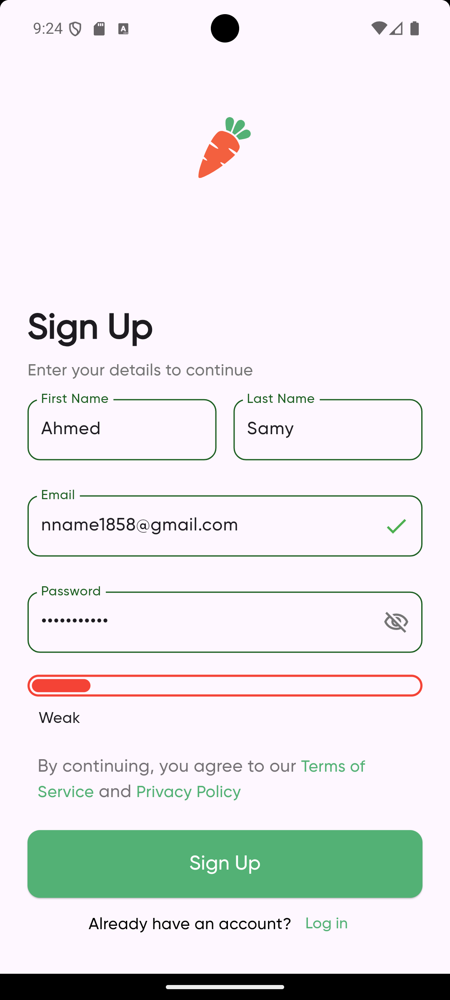 | 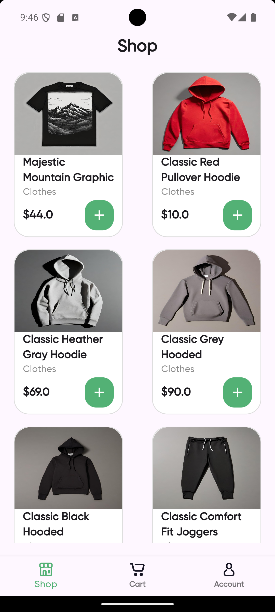 | 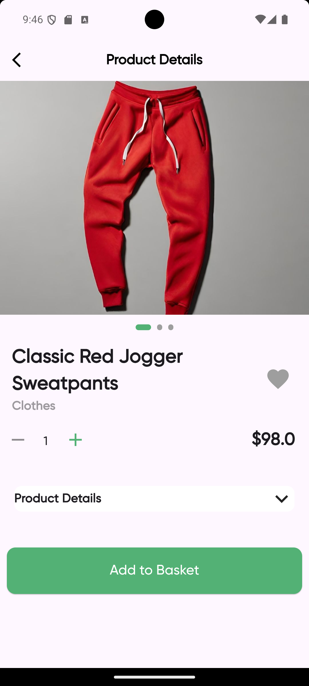 |

| Empty Cart Screen | Cart Screen | Checkout Screen |
|:-----------------:|:-----------:|:---------------:|
| 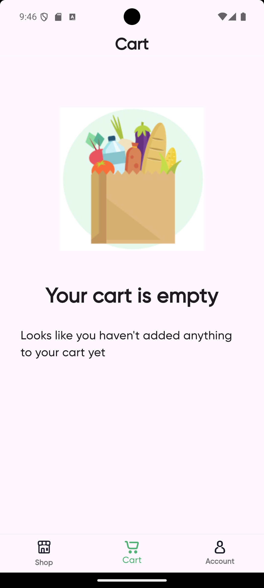 | 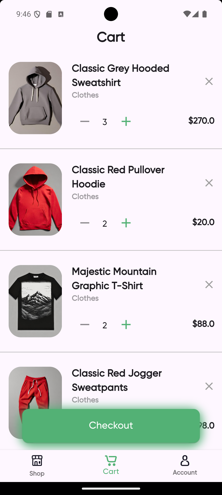 | 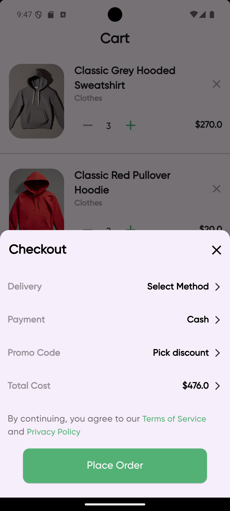 |

| Settings Screen | Order History Screen | Order Details Screen |
|:---------------:|:--------------------:|:--------------------:|
| 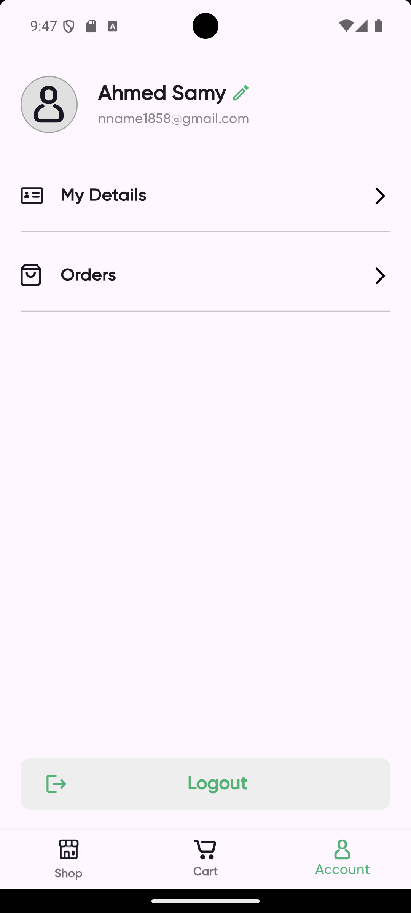 | 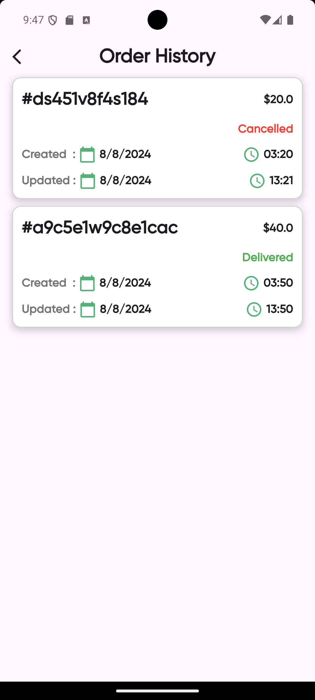 | 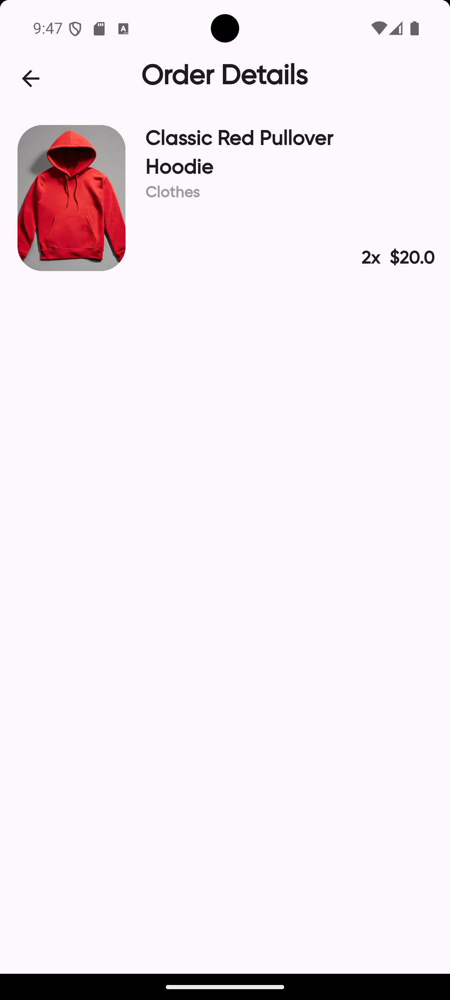 |

| Edit Profile Screen | Confirm Password Screen |
|:-------------------:|:----------------------:|
| 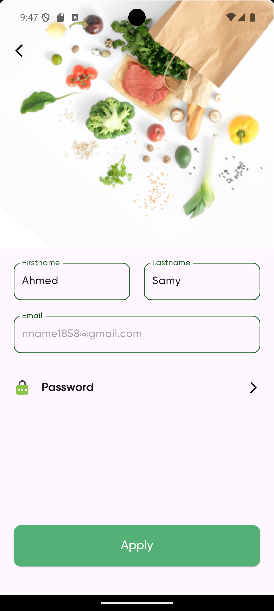 | 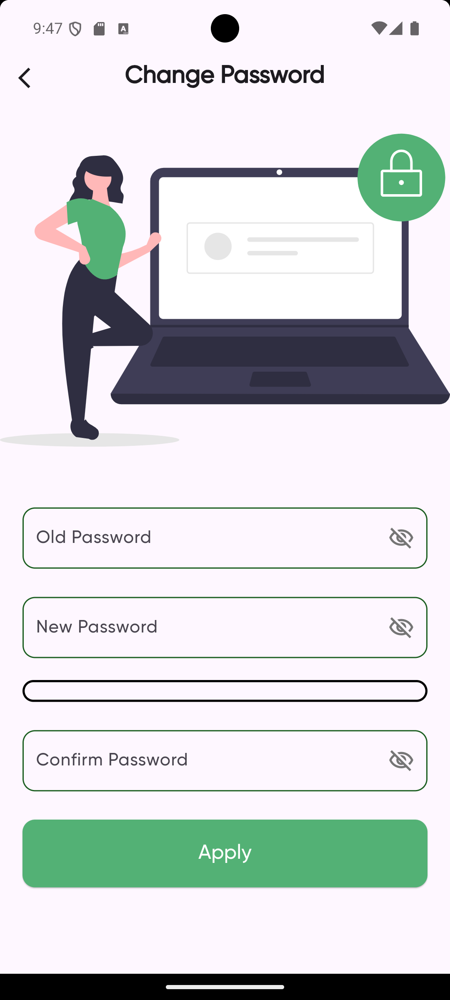 |

## 📝 Appendix

UI -> <https://www.figma.com/community/file/882645007956337261>
